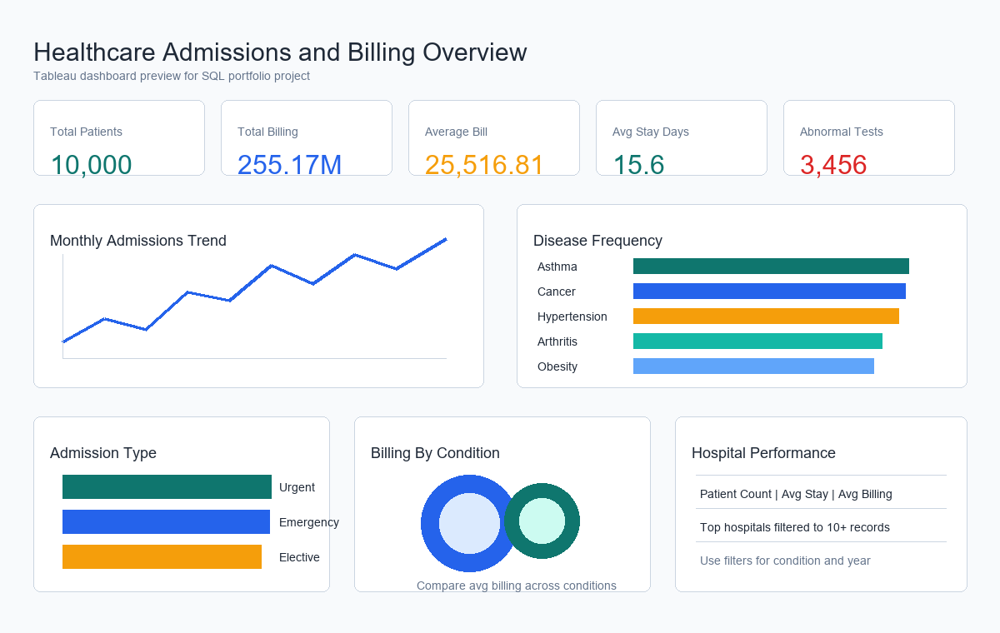

# Healthcare SQL Data Analysis


## Project Overview

This project analyzes a healthcare dataset using SQL to understand patient admissions, disease frequency, treatment costs, hospital performance, doctor activity, and discharge trends. The goal is to create a clean and recruiter-friendly data analytics project that shows practical SQL skills and business thinking.

The project uses a Kaggle healthcare dataset and prepares analysis outputs that can be used for a Tableau dashboard.

Dataset source: [Healthcare Dataset on Kaggle](https://www.kaggle.com/datasets/prasad22/healthcare-dataset)

## Problem Statement

Hospitals collect large amounts of patient, billing, admission, and treatment data. This project answers questions such as:

- Which medical conditions are most common?
- Which hospitals and doctors handle the highest patient volume?
- How do billing amounts vary by condition, admission type, and insurance provider?
- What are the monthly and quarterly admission trends?
- Which patients may need more follow-up based on test results and length of stay?

## Folder Structure

```text
Healthcare-SQL-Analysis/
|-- data/
|   `-- healthcare_dataset.csv
|-- sql/
|   `-- healthcare_analysis.sql
|-- dashboard/
|   |-- healthcare_dashboard.twb
|   |-- tableau_calculated_fields.md
|   `-- tableau_dashboard_plan.md
|-- screenshots/
|   |-- dashboard_preview.png
|   `-- dashboard_mockup.svg
|-- README.md
|-- insights.md
`-- requirements.txt
```

## Dataset Description

The dataset contains 10,000 patient admission records. Important columns include patient name, age, gender, blood type, medical condition, admission date, doctor, hospital, insurance provider, billing amount, admission type, discharge date, medication, and test results.

## Tools And Technologies

- MySQL 8+
- MySQL Workbench
- Tableau Public or Tableau Desktop
- GitHub
- CSV dataset

## SQL Concepts Used

- Database and table creation
- Views for reusable analysis
- Aggregate functions: `COUNT`, `SUM`, `AVG`, `MIN`, `MAX`
- `GROUP BY` and `ORDER BY`
- `CASE WHEN` for patient grouping
- CTEs for step-wise analysis
- Window functions: `RANK`, `DENSE_RANK`
- Date functions: `STR_TO_DATE`, `DATEDIFF`, `YEAR`, `QUARTER`, `DATE_FORMAT`
- Subqueries for comparison with overall averages
- Basic joins for donor-recipient matching

## Key Business Insights

- The dataset has 10,000 records from 2018-10-30 to 2023-10-30.
- Asthma, Cancer, and Hypertension are the most frequent conditions.
- Urgent admissions are slightly higher than Emergency and Elective admissions.
- Cigna and Blue Cross have the highest patient counts among insurance providers.
- Diabetes has the highest average billing amount among the listed conditions.
- Arthritis has the highest average length of stay.
- Abnormal test results are the most common result category, so follow-up planning is important.

More detailed findings are available in [insights.md](insights.md).

## Dashboard Overview

The Tableau dashboard is planned as a one-page healthcare performance summary with KPI cards, monthly admission trends, disease frequency, billing analysis, hospital performance, and interactive filters.



Dashboard details are available in [dashboard/tableau_dashboard_plan.md](dashboard/tableau_dashboard_plan.md).

## How To Run The Project

1. Open MySQL Workbench.
2. Run `sql/healthcare_analysis.sql` until the `healthcare_raw` table is created.
3. Import `data/healthcare_dataset.csv` into `healthcare_raw`.
4. Run the remaining SQL queries.
5. Connect Tableau to MySQL or to the CSV file.
6. Build the dashboard using the plan and calculated fields in the `dashboard/` folder.

## Future Improvements

- Add a Power BI version of the dashboard.
- Create a small ER diagram and data dictionary.
- Add stored procedures for repeated analysis.
- Add more validation checks for duplicate patient records.
- Compare billing patterns across age groups and hospitals in more detail.

## Resume Project Description

Healthcare SQL Data Analysis: Analyzed 10,000 healthcare admission records using MySQL to study patient demographics, disease frequency, hospital performance, billing patterns, doctor activity, and admission trends. Built SQL views, CTEs, window functions, and Tableau-ready dashboard metrics to present actionable business insights.


